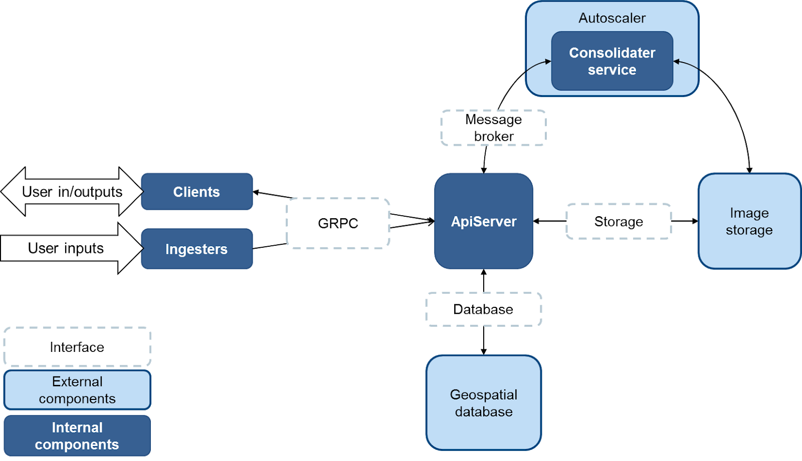

# Interfaces

Geocube is designed to be customizable and deployable in other environments. Several interfaces are declared and can be implemented to use external tools or services.



All the interfaces are declared in the `interface` folder of the repository. After implementing an interface, it may be necessary to customize the `cmd/[...]/main.go` files to use the new interface.

If you implement a new interface, it will be very welcome to submit a [contribution](https://github.com/airbusgeo/geocube/blob/main/CONTRIBUTING.md).

## Storage

### Interface

The interface storage is used to read and write the images that are indexed in the Geocube. It must be accessible in reading by range-request and should be accessible in writing to support the consolidation (optimisation of the data).
The interface is available in `interface/storage` package.

To add a storage strategy, the following methods are to be implemented:

```golang
// Download file content as a slice of byte
Download(ctx context.Context, uri string, options ...Option) ([]byte, error)
// DownloadTo a local file
DownloadTo(ctx context.Context, source string, destination string, options ...Option) error
// Upload file content into remote file
Upload(ctx context.Context, uri string, data []byte, options ...Option) error
// UploadFile into remote file
UploadFile(ctx context.Context, uri string, data io.ReadCloser, options ...Option) error
// Delete file
Delete(ctx context.Context, uri string, options ...Option) error
// Exist checks if file exist
Exist(ctx context.Context, uri string) (bool, error)
// GetAttrs returns file attribute
GetAttrs(ctx context.Context, uri string) (Attrs, error)
```

The storage is infered from the prefix of the uri (protocol). The user can add an additionnal storage by implementing the interface and adding it in the `interface/storage/uri/` package.


### Currently supported storages

Currently, the geocube code supports three storage systems: AWS-S3, GCS and filesystem.

## Messaging

### Interface

The messaging interface is available here : `interface/messaging/`.
It is used to communicate between the ApiServer and the Consolidater, and it can be used as a metric by the Autoscaler to autoscale the ressources for the consolidater. It's a parameter of the constructor of the Service Class and it is configured in the following files: `cmd/apiserver/main.go` and `cmd/consolidater/main.go`.

### Pgqueue implementation

A messaging interface based on postgres is implemented using the [btubbs/pgq](https://github.com/btubbs/pgq) library: `interface/messaging/pgqueue`. This implementation has autoscaling capabilities.


### Pubsub implementation

Geocube supports PubSub (Google Cloud Platform) messaging broker : `interface/messaging/pubsub`.

Topics and subscriptions are to be created.

Topics:
- events
- events-failed
- consolidations
- consolidations-failed
- consolidations-worker (only if autoscaler is used)

Subscriptions:
- events
- consolidations
- consolidations-worker (only if autoscaler is used)

These actions could be performed manually or with terraform.
For more information, see: https://cloud.google.com/pubsub/docs/overview.
You must have the Pub/Sub Admin role on your service account.

NB: Topics & Subscriptions must be created before running services.

A Pub/Sub emulator is available to use PubSub in a local system (with limited capacities).

Please follow the [documentation](https://cloud.google.com/pubsub/docs/emulator) to install and start the emulator.

## Database

### Interface

The database interface is available here : `interface/database/db.go`.
It is used by the ApiServer as a parameter of the constructor of the service and it is configured in the following file: `cmd/apiserver/main.go`.

### PostgreSQL Implementation

Geocube currently supports a Postgresql database with the PostGIS extension (`interface/database/pg/`).
Create a database and run the installation SQL script in order to create all tables, schemas and roles.
This script is available in Geocube code source in `interface/database/pg/create.sql`

```bash
$ psql -h <database_host> -d <database_name> -f interface/database/pg/create.sql
```

For ugrade, see [Update PostgreSQL database](#postgresql-database)

## Autoscaler

The autoscaler handles the scale-up or down of the consolidator service.
It’s an external service and does not have an interface. The current implementation, using Kubernetes, is available here : `interface/autoscaler/` and it is used in the Autoscaler service : `cmd/autoscaler/main.go`

## GRPC

Clients connect to the Geocube with a GRPC interface. This interface is automatically generated from the protobuf files in `api/v1/pb`.

From the Geocube side, protofiles are generated in the `internal/pb` folder. A GRPC server is then implemented in `internal/grpc` to interface the GRPC layer to the Geocube server.

From the client side, protofiles must be generated using the same files. It automatically creates a GRPC interface to connect to the Geocube.
See [Client Python](https://github.com/airbusgeo/geocube-client-python) or [Client Go](https://github.com/airbusgeo/geocube-client-go) for example.


Install `protoc`
``` shell
go get -u github.com/grpc-ecosystem/grpc-gateway/v2/protoc-gen-grpc-gateway
go get -u github.com/golang/protobuf/protoc-gen-go
```

Generate output from protofiles :
```bash
go generate generate.go
```

