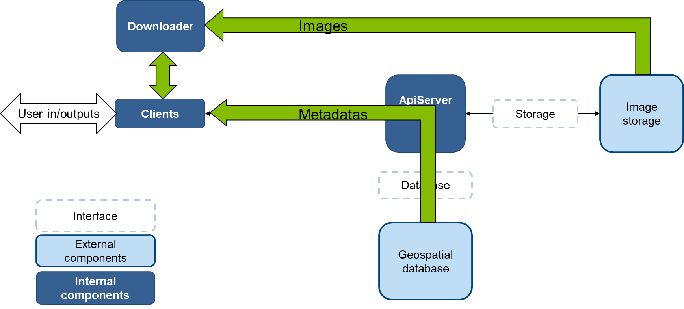

# Geocube services

The Geocube Server is composed of the ApiServer, the Consolidater, the Autoscaler and an interface layer to integrate into the user environment.

To integrate into the environment of deployment, the geocube has an interface layer. Some implementations of this layer are available and the user is free to implement others depending on its own environment.

The interfaces are available in the `interface` folder.

## API Server

The API server is the core of the Geocube. It is connected to a PostGIS database that contains the metadata on the indexed images and all the [entities](../user-guide/entities.md) describing the images or the way to interact with them.

API Server:

- is responsible for the life-cycle of all the entities (it's the only service that have access to the database) through (more or less) [CRUDL](https://en.wikipedia.org/wiki/Create,_read,_update_and_delete) operations.
- can be responsible for the life-cycle of the indexed images, through consolidation or deletion.
- gathers metadata required to reply to an image or timseries request.
- creates a cube of data, by reprojecting, rescaling, casting and mosaicing images stored in an object storage.
- delivers timeseries of data.

## Consolidater

The consolidater service is called when a consolidation job is created to optimize the data. It takes several images, an extent and a layout and it creates a unique file (COG or MUCOG) that contains the data intersecting the extent.

## Autoscaler

The autoscaler is a background service that can be used to automatically deploy consolidater workers when consolidation orders are emitted.

## Downloader

Virtual machines on which the API server run are not necessary sized to process a large number of image requests. In that case, it's possible to create more machines or more powerful ones using an other autoscaling service (e.g. Cloud Run).

Another way not to overload the API server is to request the metadatas that contain all that is necessary to create a cube of data (but not the data) and consume them in a dedicated service, called `downloader`, that is responsible for retrieving the data and create the cube.

The retrieval is strictly identical (`downloader` is actually a sub-service of `API Server`), but it can be run on the machine of the client (provided it has the appropriate rights to get the data). Thus, in a large processing flow where many workers are deployed, `geocube-client` and `downloader` will be scaled up in the same way. See [Geocube Python Client SDK1](https://github.com/airbusgeo/geocube-client-python/blob/main/Jupyter/Geocube-Client-SDK-1.ipynb) for more information on the `downloader` usage.

