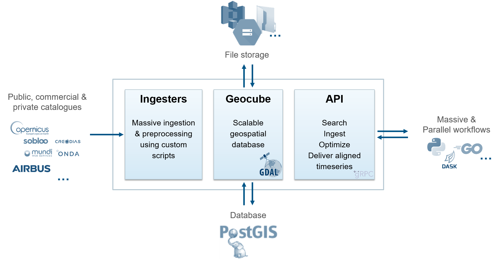

# Geocube Ecosystem

The Geocube is composed of three parts:

- Geocube Server : a scalable service using GDAL as image processing library to access and manage the geo data. Images are stored in an object storage, like GCS, AWS or local file system, and are indexed in a PostGIS Database.
- Geocube Ingester : a service responsible for massive ingestion of ARD images from any public, commercial or private catalogues. The ingesters are capable of preprocess images, using predefined or custom scripts and index them in the Geocube. An example of an ingester is available on [Github](www.github.com/airbusgeo/geocube-ingester).
- Geocube Client: an API to search images, optimize the database, ingest new images and deliver aligned timeseries for massive and parallel workflows in standard languages, such as Python or Golang and parallel computing libraries such as Dask.. A [python client](www.github.com/airbusgeo/geocube-client-python) and a [go client](www.github.com/airbusgeo/geocube-client-go) are available as example. Clients (for another language) can be created from the [protobuf files](https://developers.google.com/protocol-buffers) using the automatically generated [GRPC](https://grpc.io/) interface (see [Tutorials](https://developers.google.com/protocol-buffers/docs/tutorials)).

