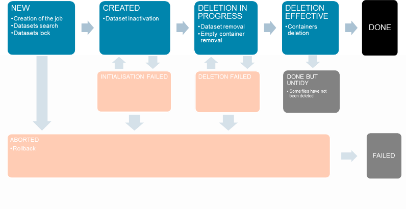

# Deletion

Datasets, and underlying files (if they are marked as "managed" by the Geocube), can be deleted from the Geocube.

Datasets to be deleted are selected by **records**, **instances** and/or **container** uri/filename.

The [DeleteDatasets()](grpc.md#deletedatasetsrequest) function will create a deletion [job](entities.md#job) that can be asynchronous or synchronous.

Below are described all the state of the deletion.

### NEW

During this step, the `datasets` are selected, regarding the `records` and the `instances`, and locked to prevent an other job from modifying them. The job is created in the database.

| Action           | Effect                                    | NewStatus              |
|------------------|-------------------------------------------|------------------------|
| ForceRetry       |                                           | NEW                    |
| Cancel           | Only if job is waiting (STEP_BY_STEP_ALL) | ABORTED                |
| ForceCancel      | Rollback                                  | ABORTED                |

### CREATED

The datasets are inactivated: they cannot be returned by GetCube/GetMetadata calls.

| Action           | Effect                               | NewStatus |
|------------------|--------------------------------------|-----------|
| ForceRetry       |                                      | CREATED   |
| Cancel           | If job is waiting (STEP_BY_STEP_ALL) | ABORTED   |
| ForceCancel      | Rollback                             | ABORTED   |

### DELETION IN PROGRESS

The dataset are removed from the database. The containers that are not referenced by at least one dataset in the Geocube are also removed and if they were managed by the Geocube (meaning: the Geocube is responsible for their lifecycle), a **deletion task** is created.

| Action           | Effect                               | NewStatus          |
|------------------|--------------------------------------|--------------------|
| ForceRetry       |                                      | DELETIONINPROGRESS |
| Cancel           | If job is waiting (STEP_BY_STEP_ALL) | ABORTED            |
| ForceCancel      | Rollback                             | ABORTED            |

### DELETION EFFECTIVE

The **deletion tasks** are processed : the Geocube deletes the file referenced by the container for each deletion task. It may be a long process and has many reasons to fail. The tasks that are successful are removed from the job, remaining the failed tasks, so that they can be retried.

| Action              | Effect                                                                                                                                                                      | NewStatus         |
|---------------------|-----------------------------------------------------------------------------------------------------------------------------------------------------------------------------|------------------|
| ForceRetry          | Retry the failed tasks                                                                                                                                                      | DELETIONEFFECTIVE |
| ForceCancel         | Mark the job as cancelled, but do not stop the pending deletion tasks. The files already deleted are not restored and some files can be deleted after the job is cancelled  | ABORTED           |

### DONE

Deletion is finished with success.

### DONE BUT UNTIDY

Something goes wrong with the deletion (usually, at least one task has failed). The Geocube is clean, but there are some files that the Geocube is responsible for that still exist, but should be deleted. 

| Action       | Effect                                              | NewStatus         |
|--------------|-----------------------------------------------------|-------------------|
| ForceRetry   | Retry all the deletion tasks that are not sucessful | DELETIONEFFECTIVE |
